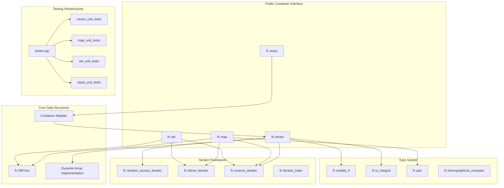

# MY::containers

A custom implementation of C++ Standard Template Library (STL) containers built from scratch, recreating fundamental STL containers (`vector`, `map`, `set`, `stack`) along with their associated iterators, type traits, and utility functions while maintaining full compatibility with C++98 standards.

## Motivation

The STL containers and iterators are a fundamental part of modern C++ programming. By recreating them from scratch, this project aims to provide a deeper understanding of how these data structures work and how they can be customized to fit specific use cases. Additionally, the project introduces some useful utilities that can make generic programming easier and more efficient.

## Purpose and Scope

This project provides a comprehensive overview of STL internals through educational implementation while ensuring compatibility with standard library counterparts. The scope encompasses:

- Four main container types with complete functionality
- A comprehensive iterator framework
- Template metaprogramming utilities
- An extensive testing suite that validates implementations against standard library equivalents

## System Architecture

The MY::containers project follows a layered architecture where public container interfaces delegate to specialized underlying data structures and share common iterator and utility systems.

### High-Level System Components



## Core Component Overview

The system consists of five primary subsystems that work together to provide complete STL-compatible container functionality:

| Component | Purpose | Key Classes | Implementation Strategy |
|-----------|---------|-------------|------------------------|
| **Container Layer** | Public STL-compatible interfaces | `ft::vector`, `ft::map`, `ft::set`, `ft::stack` | Template classes mimicking STL behavior |
| **Data Structures** | Underlying storage mechanisms | `ft::RBTree`, dynamic array management | Red-Black tree for associative containers, direct memory management for vector |
| **Iterator System** | Container traversal and element access | `ft::random_access_iterator`, `ft::rbtree_iterator`, `ft::reverse_iterator` | Category-based iterator hierarchy |
| **Type Utilities** | Template metaprogramming support | `ft::enable_if`, `ft::is_integral`, `ft::pair` | SFINAE-enabled compile-time type checking |
| **Testing Framework** | Validation and benchmarking | Test suites with dual execution model | Parallel testing against `std::` equivalents |

## Key Design Principles

The implementation follows several fundamental design principles that ensure STL compatibility while providing educational value:

### Template-Based Generic Programming
All containers are implemented as class templates that accept type parameters for element types, comparison functions, and allocators. The `ft::enable_if` utility enables SFINAE (Substitution Failure Is Not An Error) patterns for template specialization.

### Iterator Category System
The iterator framework implements the standard iterator category hierarchy:
- **Input Iterator** → **Forward Iterator** → **Bidirectional Iterator** → **Random Access Iterator**

Each container provides iterators appropriate to its access patterns: `ft::vector` uses random access iterators for O(1) element access, while `ft::map` and `ft::set` use bidirectional tree iterators for ordered traversal.

### Memory Management Strategy
- `ft::vector` implements its own dynamic array with capacity management and reallocations
- `ft::map` and `ft::set` delegate memory management to the shared `ft::RBTree` implementation
- `ft::stack` acts as a container adapter, defaulting to `ft::vector` as its underlying container

## Features

### Implemented Containers

- **`ft::vector`** - Dynamic array with random access iterators
- **`ft::map`** - Associative container with Red-Black Tree implementation
- **`ft::set`** - Unique element container with Red-Black Tree implementation
- **`ft::stack`** - LIFO container adapter

### Iterator Framework

- Random access iterators for `ft::vector`
- Bidirectional iterators for tree-based containers
- Reverse iterator adapters for all containers
- Full STL iterator traits compatibility

### Type Traits and Utilities

- `ft::enable_if` for SFINAE patterns
- `ft::is_integral` for type checking
- `ft::pair` for key-value storage
- `ft::lexicographical_compare` for container comparisons

## Usage

To use this project, simply clone the repository and navigate to the root directory. Then, type `make` to compile the project. This will create a binary file named `Contonirz` in the root directory. To run the program, type `./Contonirz`.

The program included in this project demonstrates the usage of all containers and provides an interactive testing environment where you can validate each container's functionality.

## Building and Testing

The project includes a comprehensive testing framework that validates each container against its standard library equivalent:

```bash
make all    # Build the test executable
make run    # Build and run tests
make clean  # Clean object files
make re     # Rebuild everything
```

## Unit Tests

This project includes comprehensive unit tests for each of the containers. These tests ensure that the containers are functioning correctly and produce the expected output by running parallel comparisons against their standard library counterparts.

The testing framework provides:
- Behavioral validation through side-by-side execution
- Performance comparison metrics
- Color-coded output for easy result interpretation
- Interactive menu system for selective testing

## Performance

All implementations maintain the same time complexity guarantees as their standard library counterparts:

- **Vector**: O(1) random access, O(1) amortized insertion at end
- **Map/Set**: O(log n) insertion, deletion, and search operations
- **Stack**: O(1) push, pop, and top operations

## Notion Guide

For those who are new to STL containers or are looking for a comprehensive guide, I also created a Notion guide titled "THE ULTIMATE GUIDE to STL Containers for Dummies". This guide covers the basics of STL containers, their common use cases, and advanced topics like iterators and algorithms. You can access the guide at the following link:

**[THE ULTIMATE GUIDE to STL Containers for Dummies](https://www.notion.so/containersfordummies/THE-ULTIMATE-GUIDE-e7f20768377544409ca8d036b1ab9b7f)**

## Compatibility

- **Standard**: C++98 compliant
- **Compiler**: Compatible with modern C++ compilers
- **Testing**: Parallel execution against standard library implementations

## Project Structure

The codebase is organized into focused modules that separate concerns while maintaining clear dependencies:

- **Container headers** define the public interfaces and core functionality
- **Iterator headers** implement the traversal mechanisms specific to each container type  
- **Utility headers** provide template metaprogramming support and helper functions
- **Test files** validate each container through systematic comparison testing
- **Build system** orchestrates compilation with C++98 compliance

## License

This project is licensed under the MIT License - see the LICENSE file for details.
